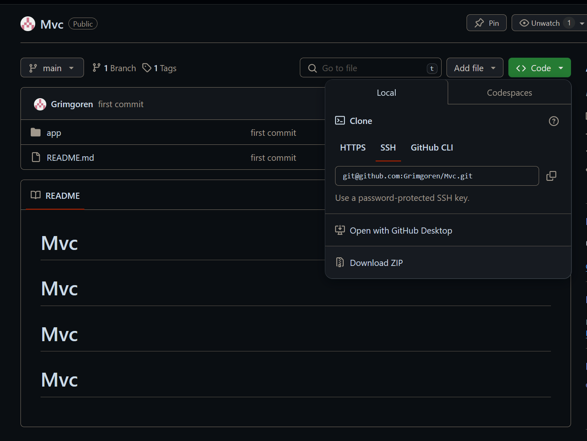
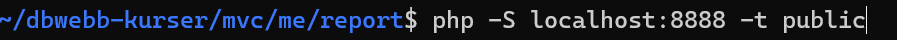
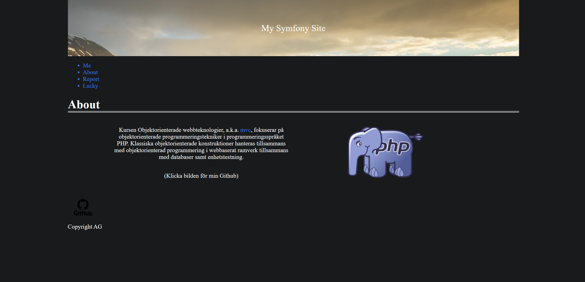

# Mvc 

# Innehåll

Detta är min github för kursen MVC, det innehåller alla kmom i kursen inklusive projektet. Innehållet hjälper mig hålla 
reda på ändringar i koden samt kvalitetssäkring med scuritinzer.

# Ladda hem projektet

1. Download ZIP.

2. Extrahera innehållet till valfri plats.

3. Navigera med Ubuntu (eller liknande) till report folder.

# Starta sidan 

Navigera till /report och copy-paste följande i terminalen för att starta servern:

$ php -S localhost:8888 -t public

Webssidan kan sedan nås på följande länk:

http://localhost:8888/

